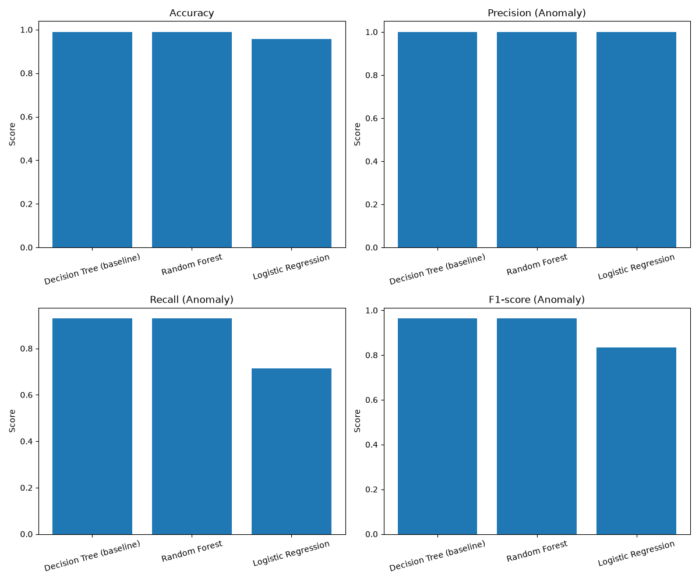
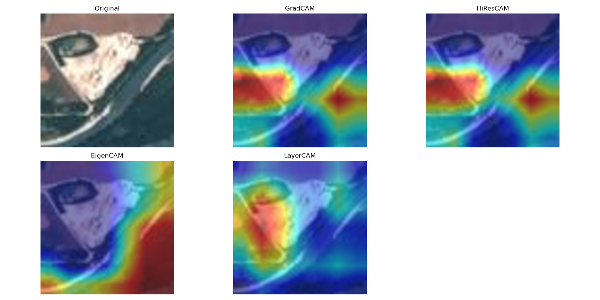
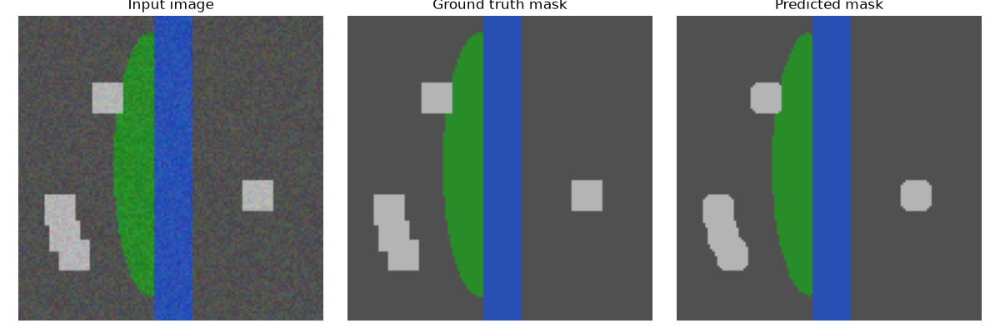

# OOAIS: Orbital Observation AI System

This project is a comprehensive Artificial Intelligence and Data Engineering pipeline designed for orbital and space observation systems. It was developed as a progressive, semester-long project, evolving from raw telemetry data processing to advanced deep learning and explainable AI for Earth Observation (EO).

## Technologies & Libraries
* **Language:** Python 3
* **Deep Learning & Computer Vision:** PyTorch, Torchvision, OpenCV, PIL
* **Machine Learning:** Scikit-Learn, Joblib
* **Explainable AI (XAI):** pytorch-grad-cam
* **Data Engineering & Analysis:** Pandas, NumPy, Matplotlib

---

## System Architecture

The project is divided into three distinct but technologically cohesive modules:

### Module 1: Telemetry Analysis & Anomaly Detection 
Processes simulated tabular telemetry data from orbital sensors (e.g., temperature, velocity, altitude) to predict and detect anomalies.
* **Feature Engineering:** Min-Max normalization and generation of derived features.
* **Machine Learning Playground:** Training, evaluation, and comparison of classical ML models (Decision Trees, Logistic Regression, Random Forests).

<p align="center">
  
  <br>
  <em>Comparison of Accuracy, Precision, Recall, and F1-Score across different classical ML models.</em>
</p>

### Module 2: Satellite Image Classification & XAI
An advanced computer vision pipeline for land-cover classification using the EuroSAT dataset.
* **Transfer Learning:** Fine-tuning a pre-trained **ResNet18** model for satellite imagery.
* **Explainable AI (XAI):** Implementation of **Grad-CAM**, HiResCAM, LayerCAM, and **Occlusion Sensitivity Analysis** to visually interpret the neural network's decision-making processes.

<p align="center">
  
  <br>
  <em>Visualizing model attention using various Explainable AI (XAI) methods (Grad-CAM, HiResCAM, LayerCAM, EigenCAM) on a classified satellite image.</em>
</p>

### Module 3: Semantic Segmentation for Earth Observation
Moves beyond image-level classification to pixel-level prediction using a custom **U-Net** architecture.
* **Synthetic EO Dataset Generator:** Automatically creates synthetic satellite scenes and corresponding pixel-perfect ground-truth masks.
* **Semantic Segmentation:** Trains a U-Net model to classify every pixel (Background, Vegetation, Water, Urban).

<p align="center">
  
  <br>
  <em>U-Net in action: (Left) Input satellite image, (Center) Ground-truth mask, (Right) Model's predicted semantic mask.</em>
</p>

---

## How to Run the Project

Ensure you have installed all dependencies via `requirements.txt`:
```bash
pip install -r requirements.txt
```
*Run all scripts from the root directory of the project using the -m flag.*

1. Telemetry & Anomaly Detection Pipeline
```bash
python -m src.ingestion.data_ingestion
python -m src.preprocessing.prepare_ml_input
python -m src.models.train_model
python -m src.models.model_playground
```

2. Vision & Explainable AI (XAI) Pipeline
```bash
python -m src.vision.train_transfer       # Trains ResNet18
python -m src.vision.create_gradcam       # Generates Grad-CAM heatmap
python -m src.vision.create_occlusion     # Generates Occlusion map
python -m src.vision.compare_cam_methods  # Compares different CAM methods
```
*(Ensure EuroSAT images are downloaded and placed in data/processed/images/ before running).*

3. Semantic Segmentation Pipeline
```bash
python -m src.segmentation.generate_synthetic_dataset  # Generates dataset & masks
python -m src.segmentation.visualize_mask              # Inspects the generated data
python -m src.segmentation.train_segmentation          # Trains the U-Net model
python -m src.segmentation.predict_segmentation        # Visualizes final predictions
```

---

## Repository Structure

```
orbital-observation-ai-system/
├── data/                  # Raw, processed, and synthetic datasets
├── models/                # Saved model weights (.pt and .joblib)
├── reports/               # Generated evaluation reports, heatmaps, and segmentation masks
├── src/                   # Source code
│   ├── ingestion/         # Lab 1-3: Data loading and validation
│   ├── preprocessing/     # Lab 4: Feature engineering
│   ├── models/            # Lab 5-6: Classical ML models
│   ├── vision/            # Lab 7-10: CNNs, ResNet18, and XAI
│   └── segmentation/      # Lab 11: U-Net and semantic segmentation
├── requirements.txt       # Project dependencies
└── README.md              # Project documentation
```